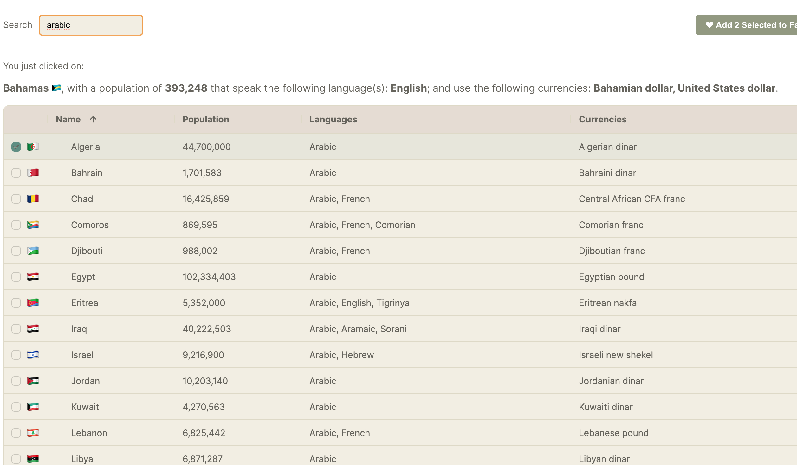
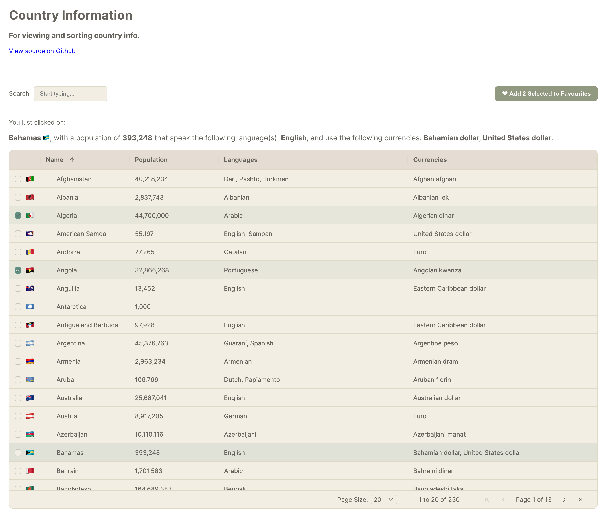

# Country Info App

A React app that returns table with all the countries in the world, their flag, currencies and languages.
Created with Ag-Grids and bootstrapped with [Create React App](https://github.com/facebook/create-react-app).

## Setup

In the project directory, run:

`npm install`

to insatll the necessary packages.

Once that is done, run:

 `npm start`

Runs the app in the development mode.\
Open [http://localhost:3000](http://localhost:3000) to view it in the browser.

## Using the App

You can filter/search the list by searching in the Search box above the rendered table.

Double-clicking on each row item returns a summary of the country info above the table. Master/detail couldn't be used as it was a Pro Feature.

